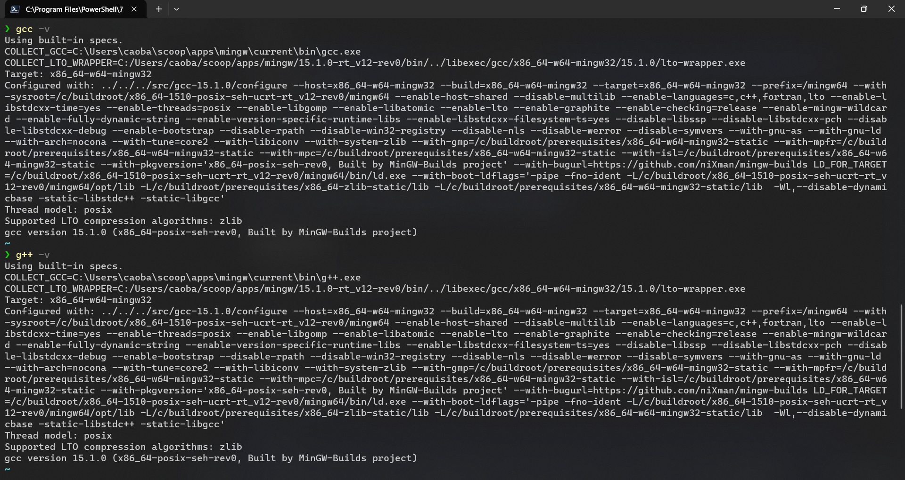
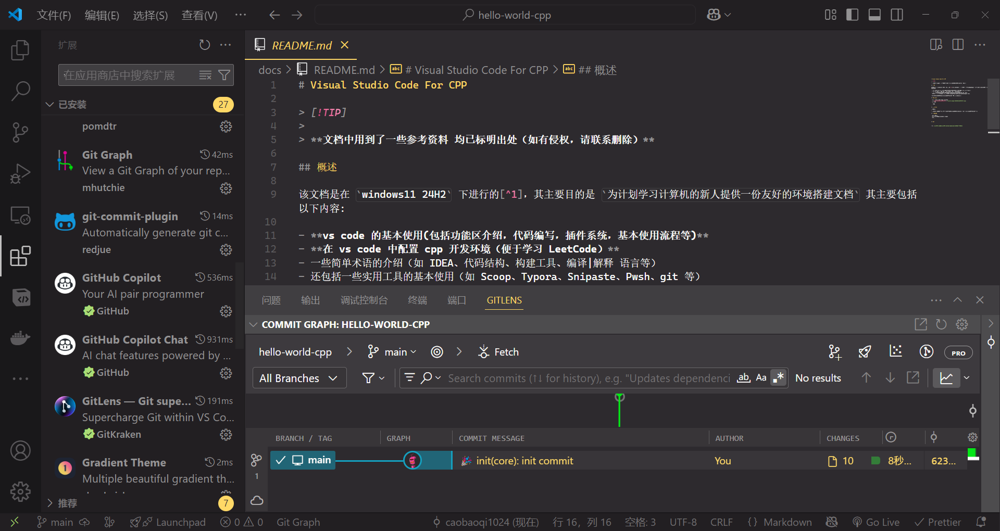

# Visual Studio Code For CPP

> [!TIP] 
>
> **文档中用到了一些参考资料 均已标明出处（如有侵权，请联系删除）**

## 概述

该文档是在 `windows11 24H2` 下进行的[^1]，其主要目的是 `为计划学习计算机的新人提供一份友好的环境搭建文档` 其主要包括以下内容: 

- **vs code 的基本使用(包括功能区介绍，代码编写，插件系统，基本使用流程等)**
- **在 vs code 中配置 cpp 开发环境（便于学习 LeetCode）**
- 一些简单术语的介绍（如 IDEA、代码结构、构建工具、编译|解释 语言等）
- 还包括一些实用工具的基本使用（如 Scoop、Typora、Snipaste、Pwsh、git 等）

**请注意：该文档并不涉及专业的知识讲解（侧重于环境搭建）**

## 成果展示

- 通过 scoop 安装 mingw 相关工具
   
   
- vs code

   
   
- cpp
	TODO

## 使用说明

> TEMP：
>
> 主要包括 视频（暂定为分 P 具体细节待定)、文档（vitepress + md + 专栏）、资料（网盘形式)

## 前置要求

- git (可选)
- 对计算机领域相关术语有基本了解
- etc..

## Ref

[^1]: 不同操作系统下相关操作略有不同但不影响本文档的参考意义
